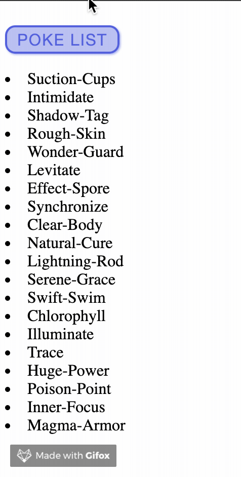

# JS Is Fun 🦑
Here you can find some examples of how to apply JS.

## Setting Up Your Flask Environment

- Create a virtual environment called `venv`: `virtualenv venv`

- Activate the environment: `source activate venv/bin/activate`

- Install Flask: `pip install flask`

*Note*: You might have to install other dependencies, depending on your approach

## Mini Challenge

- Using the `flask_example` as a reference, you will see that each time we click on the button, a paragraph is appended to the DOM element `main` (or `main` tag). Make adjustments so it will only be appended once.

- Alert the user that he/she can only add a paragraph once, in case the user keeps clicking. 🤦‍🤦‍♀️

- Useful Resources:

1) https://developer.mozilla.org/en-US/docs/Learn/JavaScript/Client-side_web_APIs/Manipulating_documents
2) https://zellwk.com/blog/dom-traversals/
3) https://medium.freecodecamp.org/whats-the-document-object-model-and-why-you-should-know-how-to-use-it-1a2d0bc5429d
4) https://blog.codeanalogies.com/2018/01/06/traversing-the-dom-visual-explanation/

## More DOM Manipulation Exercises:

Go to https://www.rithmschool.com/courses/intermediate-javascript/javascript-dom-exercises or fork this codepen:
https://codepen.io/dani-santos-code/pen/yrBywE

## API challenge

- Assuming you went through the whole Flask Tutorial and are familiar with templating in Flask (Jinja), consume the [Pokemon API](https://pokeapi.co/docs/v2.html) to display a list of pokemons with their names. Feel free to be creative and design something fancier and more beautiful.

- When the user clicks on the button, all the information should disappear and the user should see a message that reads: "No Pokemons Left"

Expected output should look something like this:

    

*Note*: Feel free to display more info and play with this API!
